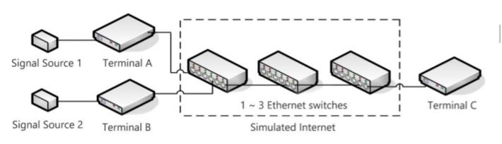

Team members:

​		Minel Huang, Peng Xu, Jiajie Cai

### Internet-based Signal Transmission System

The project requirement is that collect signals at the same time and transmit the results to another terminal across the network via TCP. Therefore, we needed to design three terminals, which are responsible for collecting signals and output signal. The system structure is as follows:

### Key Technology

The system structure is as follows:

We designed a Thermal Imaging Vision & Ultrasonic Obstacle Avoidance System which recognized obstacle types through neural network algorithms and measured distance to obstacles via the ultrasound system with an accuracy of 1 cm.

Besides, we designed GPS & Inertial Navigation & Vision Navigation System which navigated by calling a navigation app software interface and achieved accurate velocity measurement via EKF algorithm and Kalman filter. Indoor navigation system error was ±50 cm without visual calibration and ±15 cm with visual calibration.

Finally we applied for a Patent: A Wearable Intelligent Blind Guide Device (Current status: publication of invention patent application), Patent number: CN201910639192.3, and participated in the "Internet +" Innovation Competition.