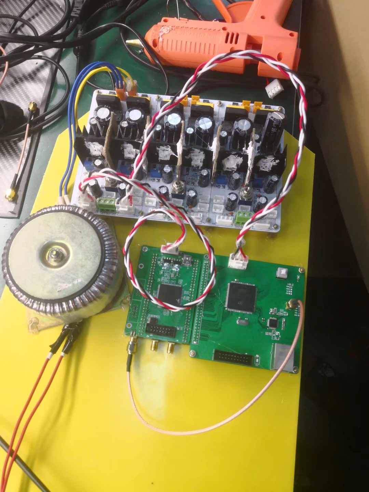

**Team members**:

​		Minel Huang, Peng Xu, Jiajie Cai

## **Internet-based Signal Transmission System**

The project requirement is that collect signals at the same time and transmit the results to another terminal across the network via TCP. Therefore, we needed to design three terminals, which are responsible for collecting signals and output signal. The system structure is as follows:

In order to synchronously collect signal in high-speed, we introduced PTP protocol based on DP83640. In addition, we introduced LwIP protocol to STM32H7 so that terminals can communicate with each other by TCP/IP connection. The final device is as follows and we participated in the National Electronic Design Competition.

**Link**:

​		STM32 codes: https://github.com/Huangxy-Minel/Internet-based-Signal-Transmission-System