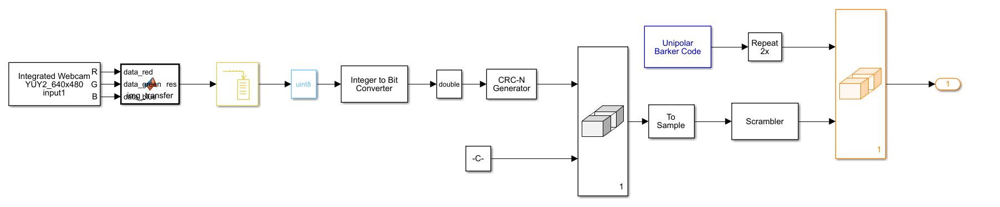
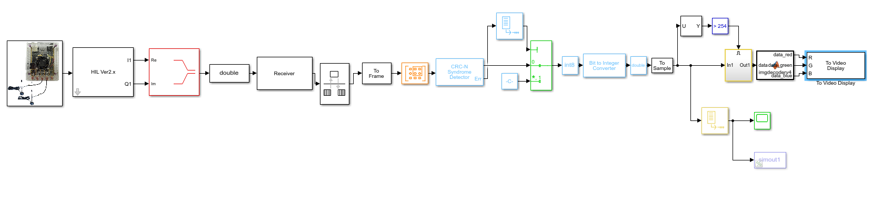

**Team members**:

​		Minel Huang, Chuhan Jiang, Shiming Yang, Diwei Xie

## **QPSK-based Image Transmission System**

In this project we designed a image transmission system based on QPSK modulation. We used MATLAB & Simulation to realize long-distance real-time image transmission, and used FM to communicate with interphone. The system structure is as follows:

Transmit structure:

Receive structure:

The final result is as follows, and the bit error rate less than 0.0003 when receiver’s SNR is 10dB.

**Link**:

​		MATLAB & Simulation projects: https://github.com/Huangxy-Minel/Long-distance-Anti-interference-Communication-System-for-Rescue-and-Disaster-Relief