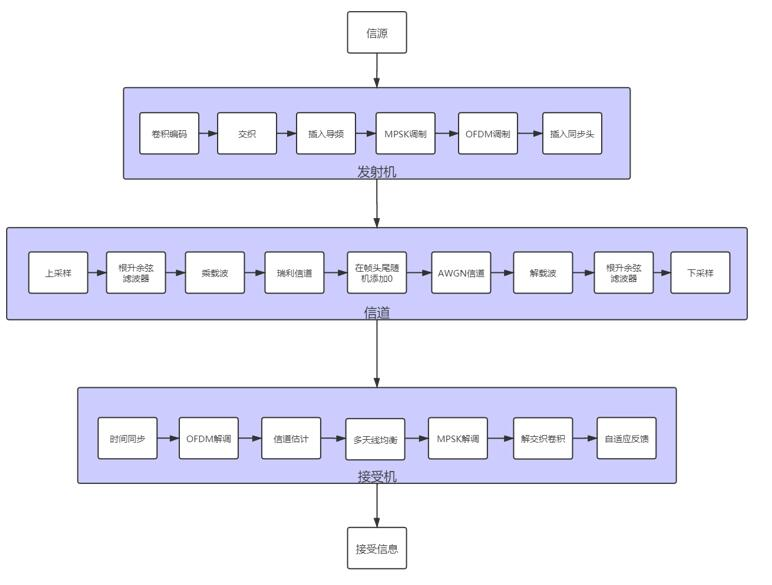
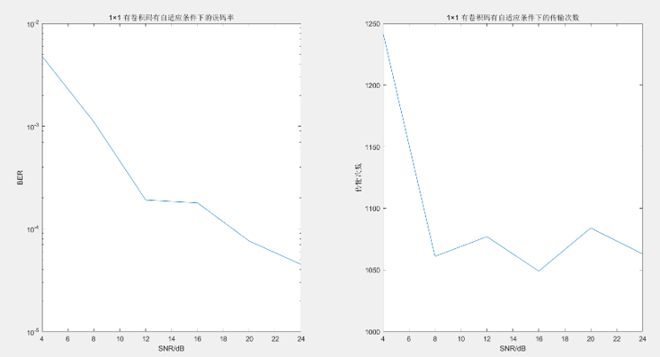

Team members:

​		Minel Huang, Chuhan Jiang, Boyu Teng

### Research on Adaptive MIMO Link based on OFDM modulation

In this project, we built a MIMO Link simulation environment based on MATLAB, and the system structure as follows:

The communication modulation is OFDM, so that we could use frequency domain information for signal equalization, which greatly reduces algorithm complexity. In order to increase the communication rate and reduce the bit error rate, we introduced MIMO equalization and adaptive technology. Final result is as follows:

Link:

​		MATLAB simulation codes: